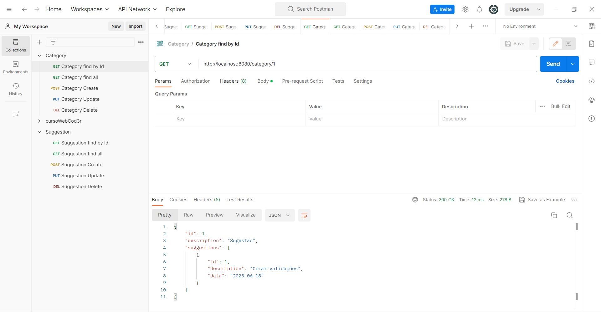
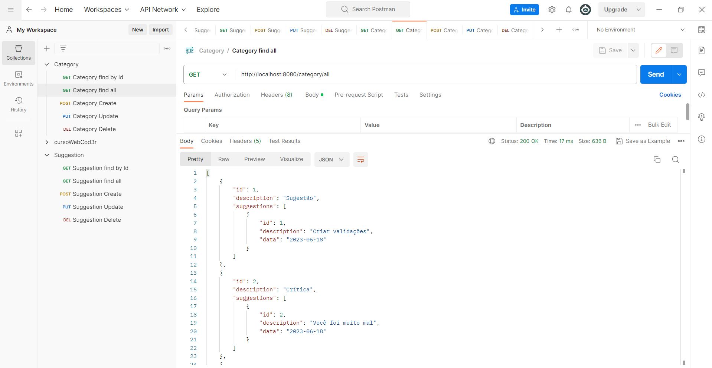
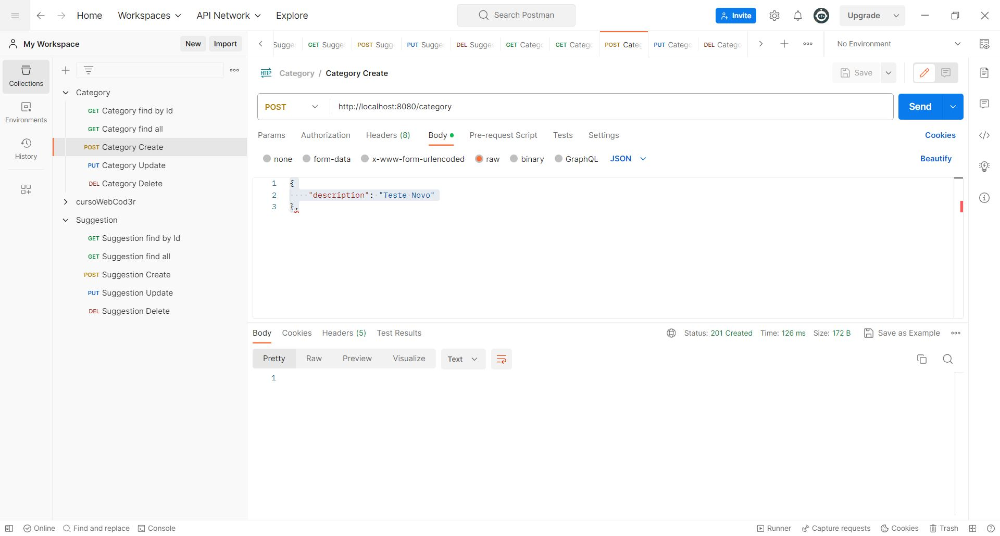
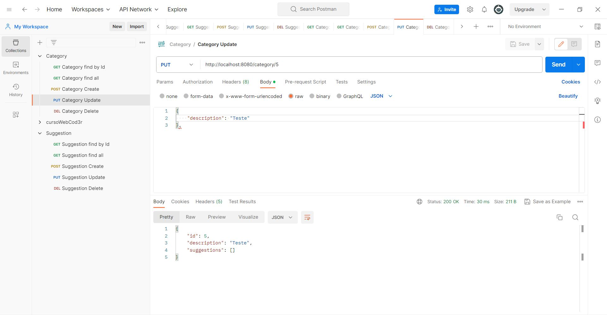
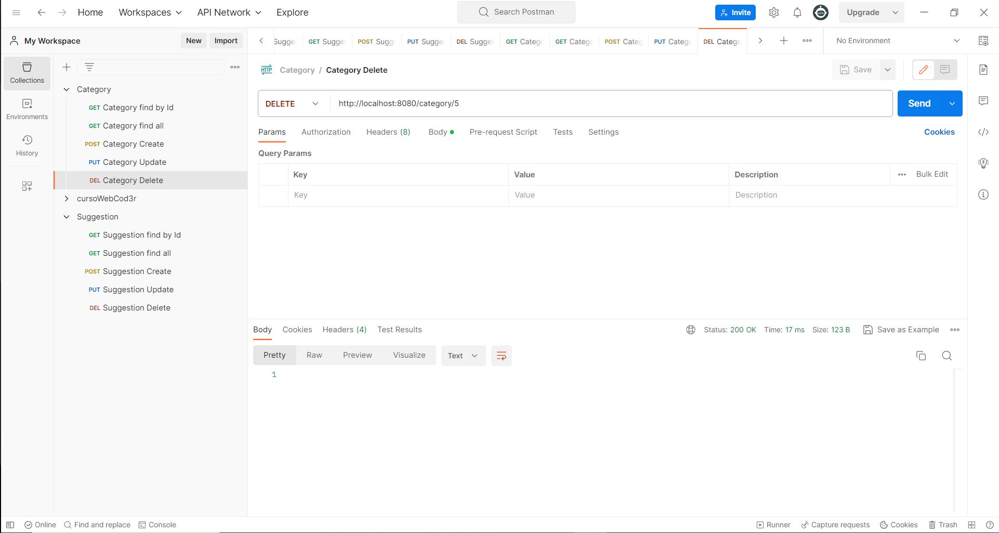
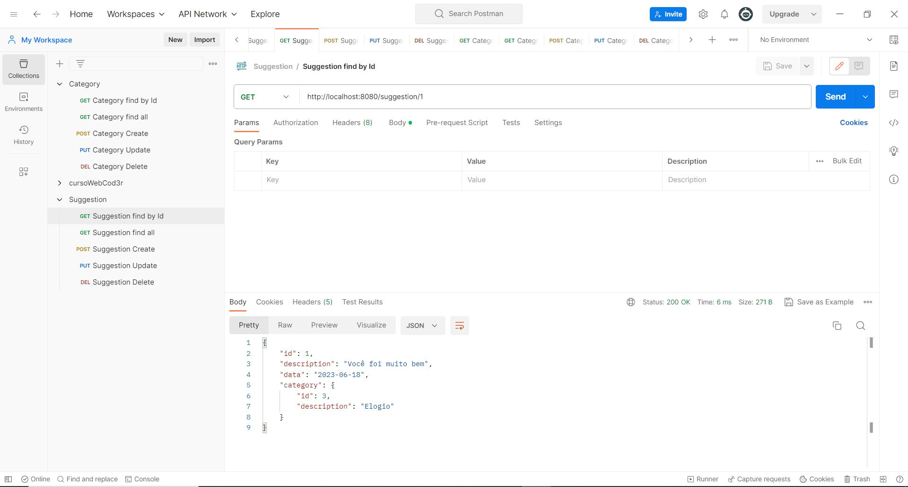
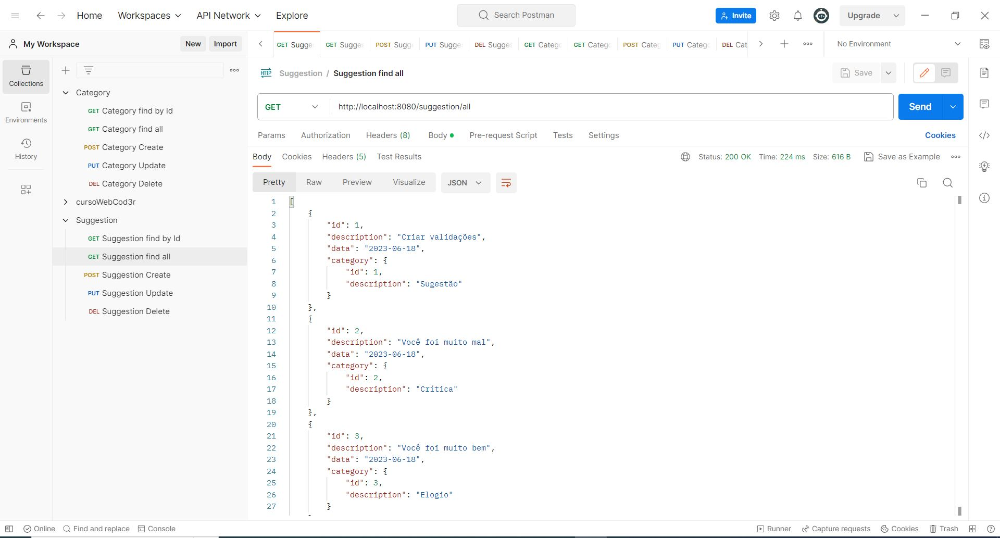
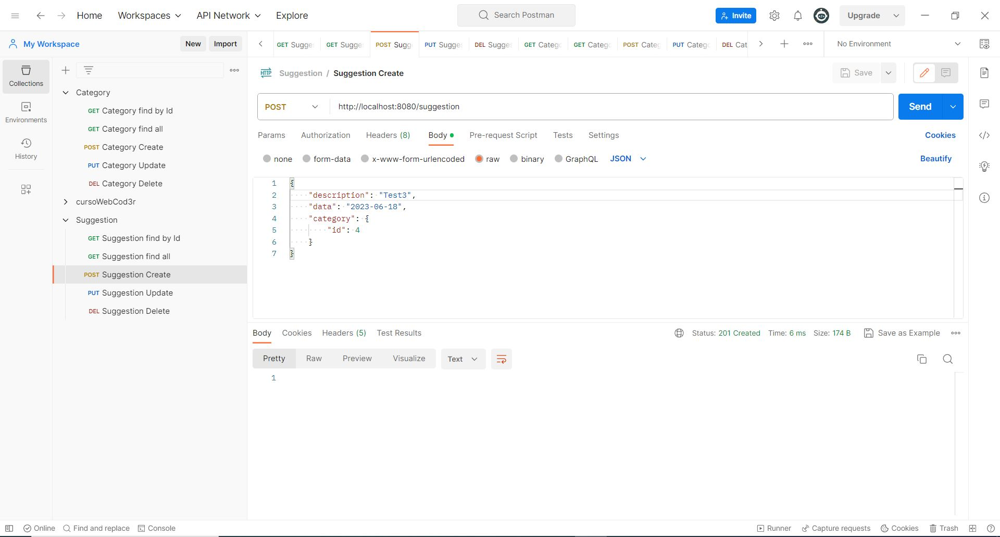
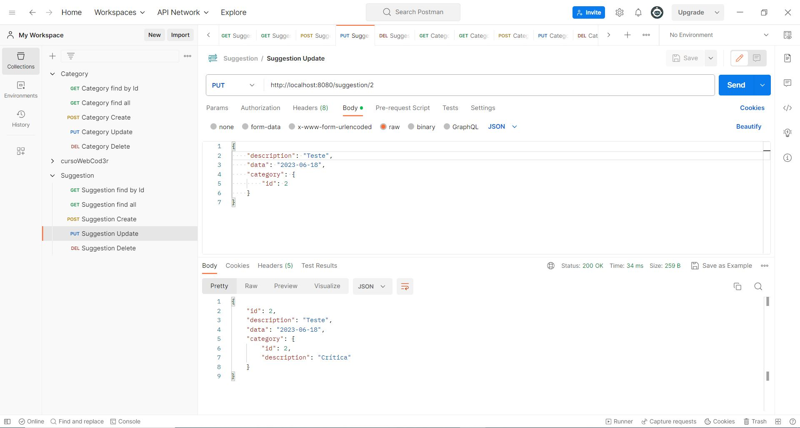
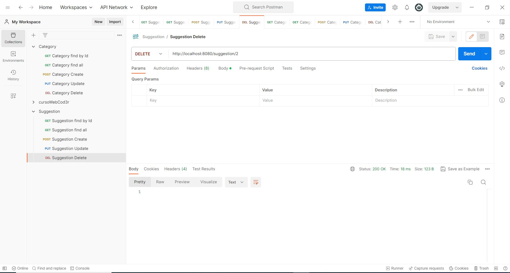

# Tarefa 09 - API SuggestionBox - Spring Boot

## Instruções

Para realização desta atividade vocês deverão com base no repositório abaixo realizar as refatorações indicadas.

Façam o checkout para a branch suggestion.

O objetivo deste projeto é reforçar o conceito das camadas Model e Controller, o desenvolvimento
de aplicações em camadas utilizando o principio de responsabilidade única, visando a alta coesão e baixo acoplamento.

Na atividade, dentro do código fonte voces encontrarão os //TODO:s de orientação; executar as instruções listadas a seguir:
Concluir o resource para o gerenciamento das sugestões;
Criar as exceções customizadas necessárias;
Posteriormente iremos criar a autenticação e o gerenciamento dos recursos com Spring Security.

# Imagens Chamadas API após aplicação da minha resolução:

##  Chamadas no Category

 

* **Category Find By Id**

 

* **Category Find All**

 

* **Category Create**

 

* **Category Update**

 

* **Category Delete**

##  Chamadas no Suggestion

 

* **Suggestion Find By Id**

 

* **Suggestion Find All**

 

* **Suggestion Create**

 

* **Suggestion Update**

 

* **Suggestion Delete**

